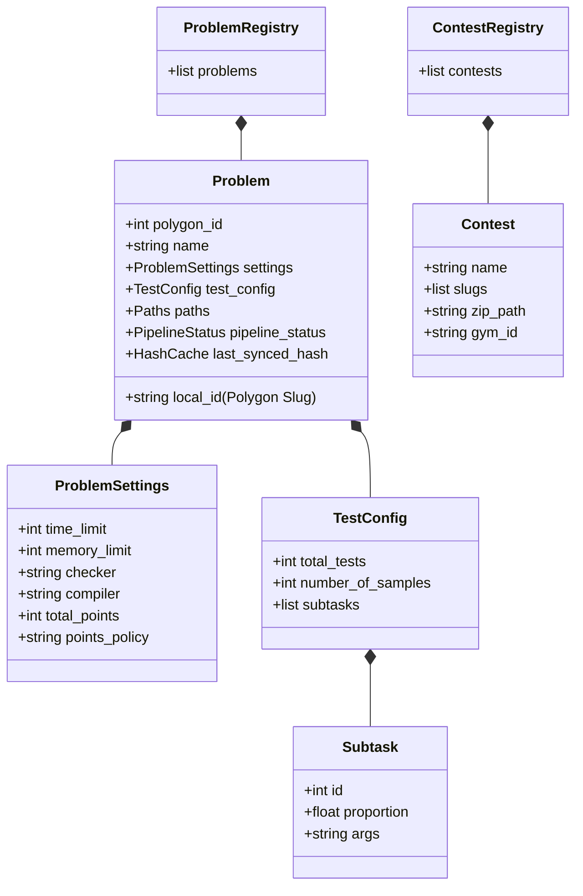
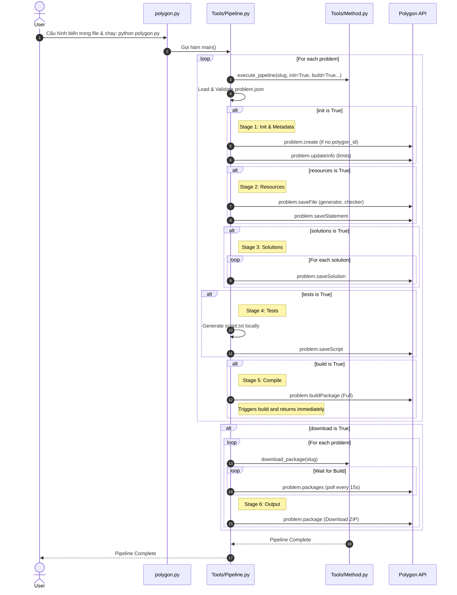
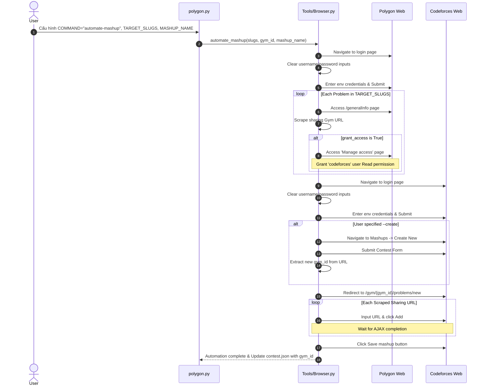

# DWUY POLYGON TOOL - Python System Architecture (v2.0.0)

This document describes the design and modular architecture of the Python-based version of the Polygon Management Tool.

The system is designed to co-exist with the old TypeScript/Node.js implementation without deleting any original source code or configuration files. It moves away from complicated external CLI structures, utilizing clean, lightweight Python modules.

---

## 1. Local Registry Schemas

The system relies on `problem.json` and `contest.json` as the Single Source of Truth. If any required property is missing from the JSON file, the parser will throw an error immediately instead of falling back to silent defaults. The defaults are only used to populate the initial JSON file when adding a new problem.

### 1.1. Graphic / Schema Map



### 1.2. `problem.json` Specification Example

Below is the full structure showing the new float-based proportions for subtasks and explicit properties:

```json
{
  "problems": [
    {
      "local_id": "mult2019",
      "polygon_id": 542264,
      "name": "Multiple of 2019",
      "paths": {
        "generator": "problems/mult2019/generator.cpp",
        "statement": "problems/mult2019/statement.tex",
        "solutions": [
          {
            "path": "problems/mult2019/main.cpp",
            "tag": "MA"
          }
        ]
      },
      "settings": {
        "time_limit": 1000,
        "memory_limit": 256,
        "checker": "std::lcmp.cpp",
        "compiler": "cpp.gcc14-64-msys2-g++23",
        "total_points": 100,
        "points_policy": "EACH_TEST"
      },
      "test_config": {
        "total_tests": 20,
        "number_of_samples": 0,
        "subtasks": [
          {
            "id": 1,
            "proportion": 0.3,
            "args": "1"
          },
          {
            "id": 2,
            "proportion": 0.7,
            "args": "2"
          }
        ]
      },
      "pipeline_status": {
        "BUILD": "READY"
      },
      "last_synced_hash": {}
    }
  ]
}
```

### 1.3. Default Settings for New Problems

When initializing a new problem via the CLI, the tool populates `problem.json` with the following explicit defaults. (If the user later removes these fields from the JSON manually, the system will throw an error).

- **`number_of_samples`**: `0`
- **`total_points`**: `100`
- **`time_limit`**: `1000` (ms)
- **`memory_limit`**: `256` (MB)
- **`checker`**: `"std::lcmp.cpp"`
- **`compiler`**: `"cpp.gcc14-64-msys2-g++23"`
- **`points_policy`**: `"EACH_TEST"` (Enables partial points by default, dividing points equally among test cases).
- **`args` (Subtasks)**: Defaults to the string representation of the subtask `id` (e.g., `"1"`, `"2"`), so the generator uses the subtask index to generate tests.
- **`local_id`**: Serves dual purpose as local folder name and the remote slug on Polygon.

### 1.4. `contest.json` Specification

Manages multiple problems packaged into a contest, tracking local paths and the remote Codeforces Gym ID.

```json
{
  "contests": [
    {
      "name": "round-1",
      "slugs": ["mult2019", "divsub"],
      "zip_path": "contests/round-1.zip",
      "gym_id": "697277" 
    },
    {
      "name": "round-2",
      "slugs": ["sort"],
      "zip_path": "contests/round-2.zip",
      "gym_id": null
    }
  ]
}
```
*(If no Gym Mashup has been created/linked for a contest, `gym_id` is saved as `null`)*

---

## 2. Directory Structure (Local Workspace)

```text
Polygon-tool/
│
├── .env                       # Secrets (Managed manually by user)
├── problem.json               # Problem Registry
├── contest.json               # Contest Registry
├── polygon.py                 # Core configuration and CLI entry script
│
├── Tools/                     # Modules
│   ├── Pipeline.py            # CLI router and orchestrator
│   ├── Method.py              # File system, API wrappers, registry validations
│   └── Browser.py             # Browser automation wrapper (Selenium operations)
│
├── problems/                  # Problems workspace
├── downloads/                 # Downloaded ZIP packages
└── contests/                  # Compiled contest ZIPs
```

---

## 3. Module Specifications

### 3.1. `Tools/Method.py` (API and File Systems)
- **Environment Management:** Reads `POLYGON_API_KEY`, `POLYGON_API_SECRET`, `POLYGON_USERNAME`, `POLYGON_PASSWORD`, `CODEFORCES_USERNAME`, `CODEFORCES_PASSWORD` from `.env`.
- **Validation Engine:** Strict parser throws a validation error if any core property is missing from the JSON registries.
- **Dynamic Script Generation:** Generates `script.txt` dynamically based on JSON config, using the subtask `id` as generator arguments.
- **Granular Pipeline Controller:** The execution method accepts boolean flags for *every* property or pipeline stage. The pipeline stages are configured directly in `polygon.py` (e.g. `init`, `resources`, `solutions`, `tests`, `build`, `download`).
- **Parallelized Build/Download:** The `build` step only triggers the build command on Polygon and immediately returns. The `download` step is handled as a separate loop that polls for completion (every 15s) and downloads the ready packages, drastically optimizing overall wait time.

### 3.2. `Tools/Browser.py` (Browser Automation)
- **Robust Auto-Login:** Instead of waiting for the user:
  1. Locates username/password input boxes on Polygon and Codeforces.
  2. **Clears** any existing text.
  3. Injects credentials from `.env` and submits.
- **Gym Mashup Creation:** Contains a dedicated function `automate_mashup` which automatically navigates to Polygon to grant 'codeforces' user Read access, scrapes sharing Gym URLs, and then navigates to Codeforces to create a new mashup and inject the URLs.
- **Dynamic Mashup Imports:** `automate_mashup(slugs, gym_id)` takes a dynamic list of target slugs and `gym_id`, avoiding hardcoded IDs or relying on intermediate text files.

---

## 4. Workflows & Sequences

### 4.1. Granular Pipeline Execution Flow

The user will trigger the pipeline by configuring the target problem slugs and boolean flags directly in `polygon.py` and running the script. The script iterates and processes the stages sequentially for each target problem, then loops again at the end for downloading.



### 4.2. Browser Automation Sequence



---

## 5. Execution Reporting

Every execution of pipelines or browser automation writes a detailed report to `automation_report.md` in the workspace root.

This report records:
- **Timestamp:** Execution date/time.
- **Pipeline Actions:** Which specific stages were executed (e.g., Statements synced, Build triggered).
- **Automation Details:** 
  - Login success.
  - New Gym Mashup ID created (if applicable).
  - List of problems successfully added to the mashup.
